  

  <code>system.status = "online"</code>
  &nbsp;•&nbsp;
  <code>location = "Brazil"</code>
  &nbsp;•&nbsp;
  <code>mode = "building"</code>

 

<h3 align="center">⚡ TECH STACK</h3>

  
  
  
  
  

 

  <samp>01. CODE &nbsp;&nbsp; 02. DESIGN &nbsp;&nbsp; 03. CREATE &nbsp;&nbsp; 04. REPEAT</samp>

  

