  

  Transformando ideias em experiências digitais simples, bonitas e funcionais.

  
  

 

<h3 align="center">Tecnologias</h3>

  

 

  
  

 

  Aprendendo, criando e evoluindo um projeto de cada vez.

